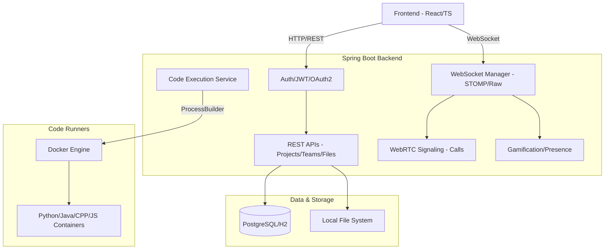

# Parallax

Parallax is a premium, full-stack collaborative development platform designed for modern engineering teams. It integrates shared coding sessions, real-time communication, project coordination, and instant code execution into a single, cohesive experience.

## Key Features

- **🚀 Real-time Collaborative Coding**: Shared workspace with Monaco editor, live cursor tracking, and instant code synchronization.
- **💬 Unified Chat System**: Integrated chat for Projects and Teams, plus secure Direct Messaging (DMs).
- **📞 Voice & Video Calling**: WebRTC-powered signaling for high-quality voice and video calls between collaborators.
- **👥 Team Management**: Create teams, invite members, and manage team-scoped workspaces and permissions.
- **📂 Project & File Management**: Hierarchical file explorer, multi-language project templates, and persistent cloud storage.
- **⚙️ Integrated Code Execution**: Multi-language support (Python, Java, C++, JS) using a pluggable, isolated Docker runner architecture.
- **🏆 Gamification System**: Earn XP and level up based on platform activity, commits, and collaboration.
- **🌐 Presence Tracking**: Real-time online/offline status updates for all friends and teammates.
- **🔐 Enterprise-Grade Security**: JWT-based authentication with seamless Google and GitHub OAuth2 integration.

## Architecture Overview



## Repository Structure

- `Parallax-Frontend/frontend`: React + TypeScript + Vite web application using Tailwind CSS 4.
- `Parallax-Backend/backend`: Spring Boot backend service handling auth, persistence, and real-time channels.
- `Parallax-Backend/parallax-python-runner`: Isolated runner infrastructure for code execution.
- `Design/`: UI/UX design artifacts and platform assets.

## Prerequisites

- **Java**: 17+
- **Node.js**: 18+ (npm 9+)
- **Docker**: Required for local code runner workflows
- **Environment**: Local `.env` files for both Frontend and Backend

## Quick Start (Local Development)

### 1) Start Backend

Navigate to `Parallax-Backend/backend`:

```bash
# macOS/Linux
./mvnw spring-boot:run

# Windows
.\mvnw.cmd spring-boot:run
```

Default backend URL: `http://localhost:8080`

### 2) Start Frontend

Navigate to `Parallax-Frontend/frontend`:

```bash
npm install
npm run dev
```

Default frontend URL: `http://localhost:3000`

## Module Documentation

- **Frontend Setup**: See [Parallax-Frontend/README.md](Parallax-Frontend/README.md) for UI configuration and service layers.
- **Backend Setup**: See [Parallax-Backend/README.md](Parallax-Backend/README.md) for API details, WebSocket configuration, and Auth setup.
- **Scaling Roadmap**: See [ARCHITECTURE_ROADMAP.md](ARCHITECTURE_ROADMAP.md) for production scaling strategies.

## Suggested Development Workflow

1. Start backend and verify health at `http://localhost:8080/api/health`.
2. Start frontend and verify landing page load.
3. Test OAuth login (Google/GitHub) and JWT persistence.
4. Validate real-time features (Workspace sync, Chat, Calls).
5. Build both modules before submitting pull requests.

## Contributing

1. Create a feature branch.
2. Synchronize frontend and backend changes for API contract updates.
3. Validate changes across primary dashboards and workspace flows.
4. Run full build/test suites locally.

## License

Refer to repository-level licensing and module notices for policy details.
