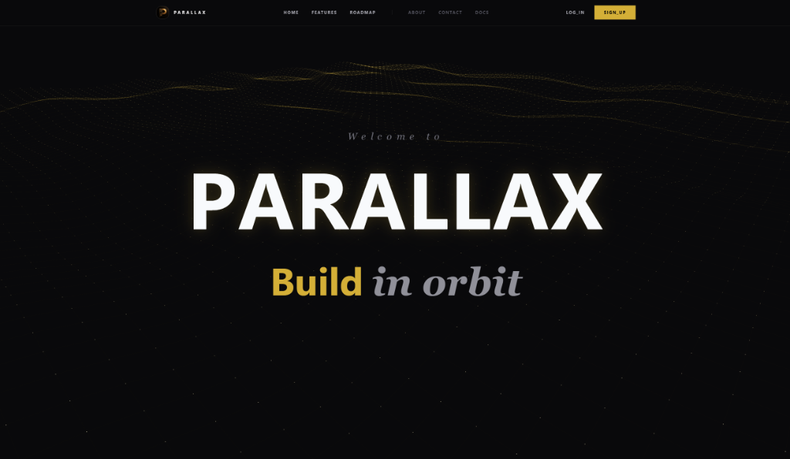
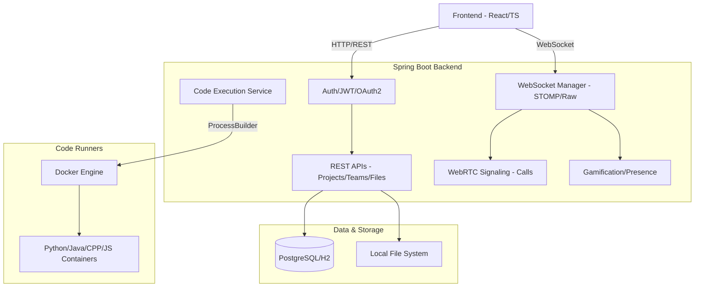

# Parallax — Premium Collaborative Development Platform

A full-stack collaborative engineering environment that merges real-time code editing, secure peer-to-peer communication, and isolated code execution into a single unified workspace.

--- 
> 

---

## Table of Contents

- [Problem Statement](#problem-statement)
- [Problem Solution](#problem-solution)
- [Project Description](#project-description)
- [Project Scope](#project-scope)
- [How to Start on Your Local PC](#how-to-start-on-your-local-pc)
- [System Design](#system-design)
- [Architecture](#architecture)
- [Contribution Guidelines](#contribution-guidelines)

---

## Problem Statement

Modern software engineering teams are increasingly distributed, yet the tools they use remain deeply fragmented. Developers often struggle with:

- **Context Switching** — Constantly jumping between code editors (VS Code), communication tools (Slack/Discord), and video conferencing (Zoom/Google Meet) breaks focus.
- **Friction in Pair Programming** — Screen sharing is non-interactive. Setting up live-share extensions often requires everyone to have the exact same IDE and environment configurations.
- **Environment Discrepancies** — "It works on my machine" remains a persistent issue during collaborative debugging. 
- **Disconnected Workflows** — Chatting about a specific line of code or running a quick script requires copying, pasting, and manually syncing environments across team members.

There is a critical need for a unified platform that natively combines the code, the execution environment, and the team communication into one seamless browser-based experience.

---

## Problem Solution

We built **Parallax** to be the ultimate virtual workspace for engineering teams:

| Problem | Our Solution |
|---------|-------------|
| Context Switching | A **Unified Interface** that places your IDE, project file tree, chat, and voice/video calling in a single browser tab. |
| Friction in Pair Programming | A **Shared Workspace** powered by Monaco Editor (the engine behind VS Code) with real-time Operational Transformation (OT) sync, allowing multiple developers to type simultaneously with live cursor tracking. |
| Environment Discrepancies | **Isolated Code Execution** powered by pluggable Docker containers. Code is executed server-side in identical, ephemeral sandboxes (Python, Java, C++, JS) ensuring consistent results for everyone. |
| Disconnected Workflows | **Integrated Communication** featuring persistent Project Chat, Workspace Team Chat, Direct Messaging, and WebRTC-powered voice/video calls built directly into the IDE. |

---

## Project Description

Parallax is a modern, premium web application built on a robust Java Spring Boot backend and a high-performance React frontend. It leverages WebSockets for sub-millisecond collaboration sync and WebRTC for peer-to-peer media.

### Key Features

- **Real-time Collaborative Coding:** Multi-file editing, OT-based conflict resolution, and zero-latency live cursors.
- **Isolated Code Execution:** Run Python, Java, C++, and JavaScript code directly in the browser. Output and errors are streamed in real-time from secure Docker containers.
- **Unified Chat System:** Persistent WebSockets for Project Chat, Team Chat, and secure peer-to-peer Direct Messaging with emoji reactions and attachments.
- **Voice & Video Calling:** Native WebRTC integration for low-latency peer-to-peer media streams, coordinated via a custom STOMP signaling engine.
- **Advanced Team Management:** Hierarchical RBAC (Role-Based Access Control) across Teams, Projects, and individual files.
- **Gamification & Productivity:** Earn XP for commits, unlock badges ("Streak Master"), and visualize activity via a GitHub-style contribution heatmap.
- **Authentication:** Secure JWT persistence with Google and GitHub OAuth2 integration.

### Tech Stack

| Layer | Technologies |
|-------|-------------|
| **Frontend** | React 18, TypeScript 5, Vite, Tailwind CSS 4, Framer Motion, Monaco Editor |
| **Backend** | Java 17, Spring Boot 3.2.x, Spring Security (OAuth2/JWT), Hibernate/JPA |
| **Real-time Engine** | STOMP over SockJS, Raw WebSockets, WebRTC |
| **Database** | PostgreSQL (Production) / H2 (Local Development) |
| **Infrastructure** | Docker Engine, Java ProcessBuilder |

---

## Project Scope

### In Scope

- Real-time multi-user code editing with conflict resolution.
- Secure, sandboxed code execution for 4 major languages.
- Comprehensive chat system (Project, Team, DM).
- Peer-to-peer WebRTC video and audio calling.
- Team and project lifecycle management with strict access controls.
- OAuth2 authentication and user profile gamification.

### Out of Scope (Future Work)

- Advanced Git version control integration (Branching, Merge Requests).
- Kubernetes-based horizontal scaling for the code runners.
- End-to-end encryption for stored chat messages.
- Mobile-native applications (iOS/Android).

---

## How to Start on Your Local PC

### Prerequisites

- **Java**: 17+
- **Node.js**: 18+ (npm 9+)
- **Docker**: Required and must be running for local code runner execution.

### Quick Start 

**1. Create environment files**

`backend/backend/.env` (Copy from `.env.example`):
```env
JWT_SECRET=your_super_secret_jwt_key_here
GOOGLE_CLIENT_ID=your_google_client_id
GOOGLE_CLIENT_SECRET=your_google_client_secret
GITHUB_CLIENT_ID=your_github_client_id
GITHUB_CLIENT_SECRET=your_github_client_secret
```

`frontend/.env.local` (Copy from `.env.example`):
```env
VITE_API_BASE_URL=http://localhost:8080
VITE_WS_BASE_URL=ws://localhost:8080
VITE_OAUTH_BASE_URL=http://localhost:8080
```

**2. Start the Backend**

Open a terminal and navigate to the backend directory:
```bash
cd backend/backend

# macOS/Linux
./mvnw spring-boot:run

# Windows
.\mvnw.cmd spring-boot:run
```
*The backend will be available at http://localhost:8080*

**3. Start the Frontend**

Open a second terminal and navigate to the frontend directory:
```bash
cd frontend

npm install
npm run dev
```
*The frontend will be available at http://localhost:3000*

---

## System Design

Parallax follows a robust client-server architecture. The Spring Boot backend acts as the central authority for authentication, persistence, and real-time event broadcasting, while Docker handles untrusted code execution.

### Services and Responsibilities

| Service | Responsibility |
|---------|---------------|
| **Frontend UI** | Renders the IDE, manages local Monaco state, handles WebRTC peer connections. |
| **Auth/API Service** | Manages JWT lifecycles, OAuth callbacks, and REST API validations for entities. |
| **WebSocket Manager** | Routes STOMP messages for presence, chat, and signaling, while maintaining raw WebSocket pipes for high-frequency cursor/code sync. |
| **Execution Service** | Receives code payloads, maps them to the correct Docker image, spawns isolated containers, and streams `stdout`/`stderr` back to the client. |

### Data Flow Examples

**Collaborative Typing:**
```
Browser 1 (Monaco) → Computes OT Delta → Frontend WebSocket
→ Backend WebSocket Manager (/ws/project/{id})
→ Broadcast to all active sessions → Browser 2 applies Delta
```

**Code Execution:**
```
Browser → POST /api/execute-code (Language, Code, SessionID)
→ Backend Execution Service → Rate limit & Lock check
→ Java ProcessBuilder (`docker run --rm parallax-python-runner ...`)
→ Standard Output streamed → WebSocket Broadcast (/topic/run-output)
→ Terminal UI updates in real-time
```

**WebRTC Calling:**
```
Caller Browser → Generates SDP Offer → STOMP (/app/call.offer)
→ Backend Signaling Engine → STOMP (/topic/user/{receiverId}/call)
→ Receiver Browser → Generates SDP Answer → Backend → Caller Browser
→ Direct Peer-to-Peer WebRTC Media Stream Established
```

---

## Architecture


```mermaid
graph TD
    Client[Frontend - React/TS]
    
    subgraph Backend[Spring Boot Backend]
        Auth[Auth/JWT/OAuth2]
        APIs[REST APIs - Projects/Teams/Files]
        WS[WebSocket Manager - STOMP/Raw]
        Signaling[WebRTC Signaling - Calls]
        Execution[Code Execution Service]
        Gamification[Gamification/Presence]
    end
    
    subgraph Storage[Data & Storage]
        DB[(PostgreSQL/H2)]
        FileSystem[Local File System]
    end
    
    subgraph Infrastructure[Code Runners]
        Docker[Docker Engine]
        Runners[Python/Java/CPP/JS Containers]
    end
    
    Client -- HTTP/REST --> Auth
    Client -- WebSocket --> WS
    Auth --> APIs
    APIs --> DB
    APIs --> FileSystem
    WS --> Signaling
    WS --> Gamification
    Execution -- ProcessBuilder --> Docker
    Docker --> Runners
```

---

## Contribution Guidelines

We welcome contributions to make Parallax even better! 

### Development Workflow

1. **Fork & Clone**: Fork the repository and clone it locally.
2. **Branch**: Create a feature branch (`git checkout -b feature/amazing-feature`).
3. **Commit**: Write descriptive commit messages.
4. **Test**: Ensure your code passes all backend tests by running `mvn test` in the `backend/backend` directory. We currently have a robust suite of unit tests verifying core business logic.
5. **Push & Pull Request**: Push your branch and open a PR against `main`.

### Code Style

- **Frontend**: Follow functional React patterns, strict TypeScript typing, and Tailwind utility class conventions.
- **Backend**: Adhere to standard Java naming conventions, utilize Lombok to reduce boilerplate, and keep business logic isolated within `@Service` classes.
- **Testing**: Use JUnit 5 and Mockito. All new services must include unit tests for primary happy and unhappy paths.

### Reporting Issues

Use GitHub Issues to report bugs or request features. Please include environment details, steps to reproduce, and any relevant error logs or screenshots.

---

*Refer to the repository-level licensing notices for policy details.*
