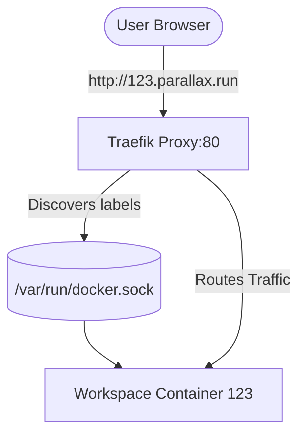

# Parallax Architecture & Feature Changelog (Detailed)

This document provides a highly detailed, technical breakdown of the recent architectural changes made to the Parallax IDE. It covers infrastructure upgrades, specific class-level refactoring, new database entities, and the Git/AI system integrations.

---

## 1. Universal Workspace Container Architecture

Previously, Parallax executed code by spinning up an ephemeral Docker container for every single file execution (`docker run --rm`). This was slow and isolated state. We have migrated to a **Persistent Universal Workspace** model.

### 1.1 `Dockerfile.workspace`
We created a heavy-duty Dockerfile that serves as the universal runtime for all projects, regardless of the primary language.
- **Base OS:** Ubuntu 22.04 (Jammy).
- **Toolchains Installed:**
  - `python3`, `python3-pip`
  - `openjdk-17-jdk-headless`
  - `nodejs` (v20.x via NodeSource), `npm`
  - `build-essential` (GCC, G++)

### 1.2 `SessionRegistry` and `SessionService` (Java Backend)
- **`SessionRegistry.SessionInfo`:** Expanded to track a `webPort` property.
- **Port Allocation:** When a project is opened, `SessionService` dynamically allocates an available host port using `new ServerSocket(0)` and binds it to container port `3000`.
- **Persistent Container Lifecycle:** `SessionService.startSession()` now runs:
  ```bash
  docker run -d --name <containerName> --network parallax-network -p <webPort>:3000 \
    -l traefik.enable=true -l traefik.http.routers.proj-<id>.rule=Host(`<id>.parallax.run`) \
    -v <sessionBasePath>:/workspace parallax-workspace tail -f /dev/null
  ```
  This keeps the container alive indefinitely until the session ends.

### 1.3 `RunCodeService` & `WebProjectExecutionService`
- Both services were refactored to replace `docker run` with `docker exec`.
- **`WebProjectExecutionService.stopServer()`:** Instead of killing the container (which would kill the user's workspace), it now surgically executes `pkill -f node` inside the specific container to terminate the web server process.

---

## 2. True Pseudo-TTY (PTY) Terminal

To support interactive terminal sessions (e.g., `vim`, `top`, or REPLs), the terminal integration was upgraded to behave like a true TTY.

- **`TerminalWebSocketHandler.java`:**
  - When the frontend `xterm.js` instance connects, the backend now spawns a process using Java `ProcessBuilder`.
  - **Command:** `docker exec -it <containerName> /bin/bash`
  - **Environment Variables:** Injected `TERM=xterm` to ensure the shell outputs correct ANSI escape codes for formatting and cursor movement.
  - Standard input/output streams are directly piped between the WebSocket session and the running bash process.

---

## 3. Asynchronous Build Queue (Redis)

To handle heavy operations (like CI/CD builds or environment provisioning) without blocking web request threads, we implemented a Redis-backed queue.

- **Dependencies:** Added `spring-boot-starter-data-redis` to `pom.xml`.
- **Infrastructure:** Added a `redis:7-alpine` service to `docker-compose.yml`.
- **`BuildQueueService.java`:**
  - Implemented as a Spring `@Service`.
  - Uses `RedisTemplate<String, String>` to push JSON-serialized tasks to a Redis List (`build-queue`).
  - Contains a `@PostConstruct` background thread pool that polls the queue via a blocking `rightPop("build-queue", 5, TimeUnit.SECONDS)`.
  - **Benefit:** Decouples task submission from execution, drastically improving backend scalability.

---

## 4. Wildcard Preview Deployments (Traefik)

To allow users to access their running web projects via clean URLs (e.g., `http://<projectId>.parallax.run`), we integrated **Traefik** as a dynamic API Gateway.

### 4.1 Architecture


### 4.2 Implementation
- **`docker-compose.yml`**: Deploys `traefik:v2.10` with `--providers.docker=true`. The Traefik dashboard is exposed on port `8081` (moved from 8080 to prevent conflicts with Spring Boot).
- **Dynamic Routing:** As shown in section 1.2, `SessionService` injects Traefik labels into the `docker run` command. Traefik listens to the Docker daemon socket, detects these labels, and instantly creates a routing rule matching the `Host` header to the container's mapped port.

---

## 5. Code Reviews & Inline Comments

We implemented a full "Pull Request" style code review system directly into the IDE editor.

### 5.1 Backend Entities & Endpoints
- **`CodeComment.java` (Entity):**
  - Stores: `UUID id`, `UUID projectId`, `String filePath`, `int lineNumber`, `UUID authorUserId`, `String content`, `boolean resolved`, `Instant createdAt`.
- **`CodeCommentController.java`:**
  - `GET /api/projects/{projectId}/comments?filePath=...`
  - `POST /api/projects/{projectId}/comments`
  - `PUT /api/projects/{projectId}/comments/{commentId}/resolve`

### 5.2 Frontend Integration (`CodeEditor.tsx`)
- **State Management:** Uses React `useEffect` hooks to fetch comments for the active `filePath` via the REST API.
- **Monaco `DecorationsCollection`:** 
  - Comments are mapped into Monaco Editor decorations.
  - **Visuals:** Applies a custom CSS class (`bg-yellow-500/20`) to highlight the entire line where a comment exists, and injects a `hoverMessage` (Markdown tooltip) containing the comment content.
- **Editor Actions:** 
  - Registered a custom Monaco Action (`Ctrl/Cmd + M`).
  - When triggered, it grabs the user's current cursor `lineNumber`, prompts for a comment string, POSTs it to the backend, and instantly updates the decorations.

---

## 6. Git System & AI Integrations

Parallax is deeply integrated with GitHub and AI reviewing systems, allowing it to function as a complete Git client and AI collaborator.

### 6.1 `Project` Entity Updates
- Added `String githubRepoUrl` to track the remote origin.
- Added `boolean aiReviewEnabled` to toggle AI functionalities.

### 6.2 `ProjectServiceImpl`
- **`createProject`:** Detects if a `githubRepoUrl` is provided during initialization. If so, it invokes `githubService.importRepositoryToProject(project, ownerId)` to pull the remote files into the Parallax file tree instead of generating default boilerplate.
- **`createPullRequest`:** Exposes a method to take the current state of the Parallax workspace, commit it to a specific branch, and push a Pull Request to the remote GitHub repository via `GitHubService`.
- **Clean Root Generation:** We removed the legacy behavior that forced a default `src/` directory upon project creation. Boilerplate files (`main.py`, `index.js`, etc.) are now correctly placed at the repository root.

### 6.3 Relational Infrastructure
The system now supports advanced collaboration through the following repositories:
- `MergeRequestRepository`: Tracks internal PRs within Parallax.
- `ProjectCollaboratorRepository`: Manages user roles (Owner, Editor, Viewer).
- `ProjectInvitationRepository`: Handles pending invites to projects.
- `ChatRepository`: Stores chat histories (used for conversational AI interactions within the IDE).
- `ProjectAccessManager`: Enforces strict Role-Based Access Control (RBAC) across all operations.
